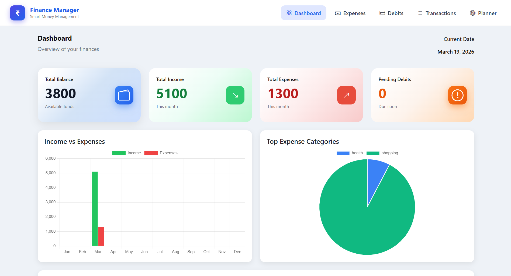
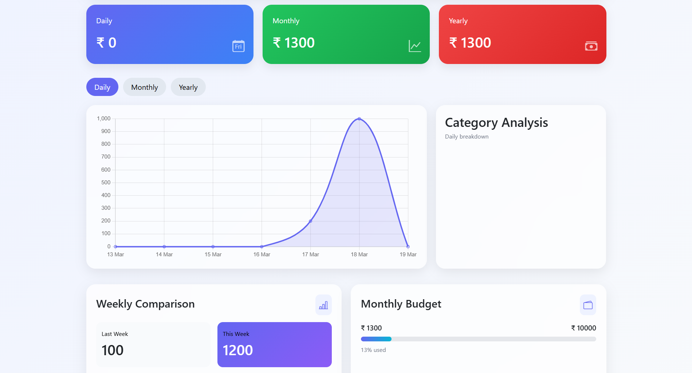
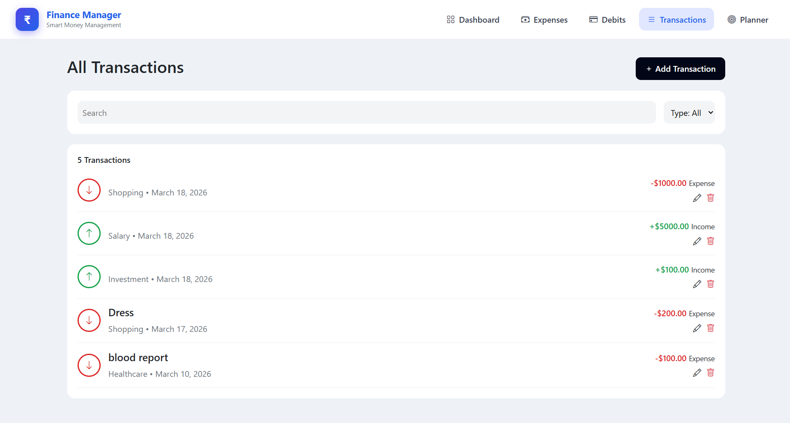
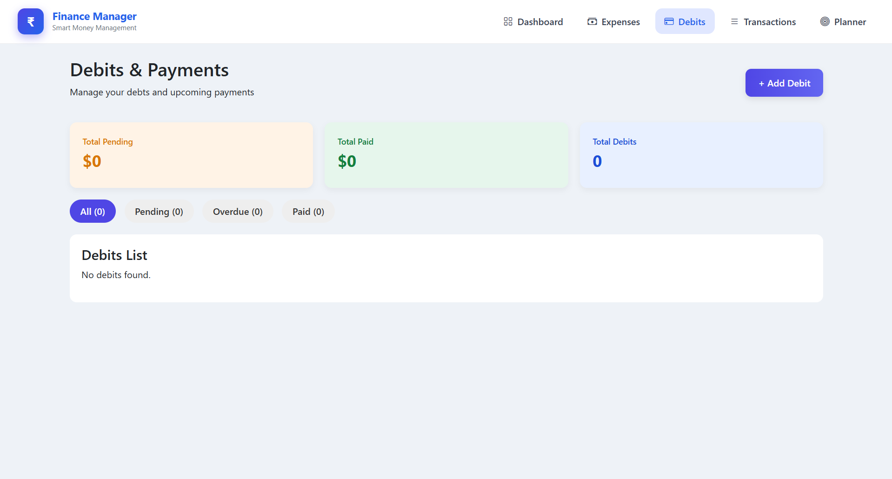

# 💰 Finance Management System

A modern and user-friendly **Finance Management Dashboard** built using Django that helps users track, analyze, and manage their expenses efficiently.

---

## 🚀 Features

### 📊 Dashboard (Analysis Page)

* Visual representation of financial data using charts
* Quick overview of income and expenses
* Helps in understanding spending patterns

---

### 💸 Expenses Page

* Displays expenses categorized (e.g., Shopping, Health, Food, etc.)
* Supports filtering based on:

  * 📅 Daily
  * 📆 Monthly
  * 📈 Yearly
* Interactive charts for better insights

---

### 📜 Transactions Page *(Under Development)*

* Shows complete history of transactions
* Tracks debit records and financial activity
* Will include advanced filtering and search features

---

### ➖ Debit Page *(Under Development)*

* Add and manage debited amounts
* Simple form-based input system
* Will be integrated with transaction history

---

### 🎯 Planner Page *(Coming Soon)*

* Set financial goals
* Plan budgets effectively
* Track goal progress

---

## 🛠️ Tech Stack

* **Frontend:** HTML, CSS, Bootstrap
* **Backend:** Django (Python)
* **Database:** SQLite3
* **Charts:** Chart.js

---

## 📸 Screenshots


### 📊 Dashboard



### 💸 Expenses



### 📜 Transactions



### ➖ Debit Page



---

## ⚙️ Installation & Setup

### 1️⃣ Clone the Repository

```bash
git clone https://github.com/your-username/your-repo-name.git
cd your-repo-name
```

---

### 2️⃣ Create Virtual Environment

```bash
python -m venv venv
```

Activate it:

* Windows:

```bash
venv\Scripts\activate
```

* Mac/Linux:

```bash
source venv/bin/activate
```

---

### 3️⃣ Install Dependencies

```bash
pip install -r requirements.txt
```

---

### 4️⃣ Run Migrations

```bash
python manage.py migrate
```

---

### 5️⃣ Start Server

```bash
python manage.py runserver
```

---

### 6️⃣ Open in Browser

```
http://127.0.0.1:8000/
```

---

## 🔐 Environment Variables

Create a `.env` file in the root directory and add:

```
SECRET_KEY=your-secret-key
DEBUG=True
```

⚠️ Make sure `.env` is included in `.gitignore`

---

## 📌 Project Status

| Feature      | Status         |
| ------------ | -------------- |
| Dashboard    | ✅ Completed    |
| Expenses     | ✅ Completed    |
| Transactions | 🚧 In Progress |
| Debit Page   | 🚧 In Progress |
| Planner      | 🔜 Coming Soon |

---

## 🎯 Future Improvements

* Advanced analytics & insights
* Export reports (PDF/Excel)
* User authentication system
* Budget alerts & notifications
* Mobile responsiveness improvements

---

## 🤝 Contributing

Contributions are welcome!

1. Fork the repo
2. Create a new branch
3. Make your changes
4. Submit a pull request

---

## 📄 License

This project is for educational purposes.

---

## 👨‍💻 Author

Developed by **Barnali Kalita**

---

⭐ If you like this project, give it a star on GitHub!
